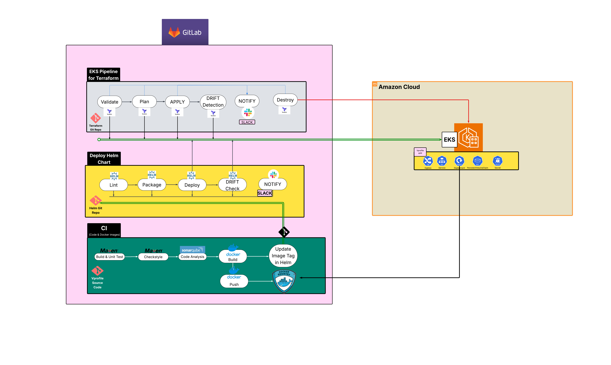

# 🚀 DevOps Project – Application Deployment on Kubernetes (EKS)

## 📘 Overview
This project demonstrates a complete DevOps pipeline for provisioning cloud infrastructure, building and containerizing an application, and deploying it to a Kubernetes (EKS) cluster using Terraform, CI/CD, and Helm.

It covers the entire lifecycle:

- **Infrastructure provisioning** with Terraform  
- **Continuous Integration (CI)** for building, testing, and Dockerizing the application  
- **Continuous Deployment (CD)** to Kubernetes (EKS) via Helm charts  

---

## 🧩 Repository Structure

### 🏗️ Terraform - Infrastructure Stack
Contains all Terraform configurations responsible for:

- Provisioning the AWS EKS cluster  
- Creating the necessary VPC, subnets, IAM roles, and node groups  
- Managing remote state and reusable infrastructure variables  

> This is the **Infrastructure as Code (IaC)** layer ensuring consistent and repeatable environment creation.

---

### 🧱 Application - CI Stack
Includes:

- Application source code  
- Dockerfile for building the container image  
- CI pipeline (GitHub Actions, Jenkinsfile, or GitLab CI) for building, testing, and pushing images to a registry (Docker Hub or ECR)  

> This represents the **Continuous Integration (CI)** part — code is automatically built, tested, and packaged.

---

### ☸️ Kubernetes & Helm - CD Stack
Contains:

- Helm charts for deploying the application on the EKS cluster  
- Environment-specific values (e.g., `values-dev.yaml`, `values-prod.yaml`)  
- CI/CD configuration for automated Helm deployments  

> This is the **Continuous Deployment (CD)** layer, managing releases and versioned deployments in Kubernetes.

---

## 🔄 CI/CD Pipeline Overview
1. **Code Commit:** Developer pushes code to the repository  
2. **CI Stage:**  
   - Run unit tests  
   - Build Docker image  
   - Push to container registry  
3. **Terraform Stage:**  
   - Provision EKS and related infrastructure  
4. **CD Stage:**  
   - Deploy the Helm chart to EKS  
   - Verify deployment health and rollback if needed  

### 🖼 Pipeline Diagram

---

## 🧰 Tools & Technologies

| Category          | Tools                           |
|------------------|---------------------------------|
| Infrastructure    | Terraform, AWS EKS             |
| CI/CD             | GitHub Actions / Jenkins / GitLab CI |
| Containerization  | Docker                          |
| Deployment        | Helm, Kubernetes               |
| Version Control   | Git & GitHub                   |

---

## 🌐 Objectives
- Implement a fully automated DevOps workflow from code to deployment  
- Demonstrate **Infrastructure as Code (IaC)** using Terraform  
- Use **Helm** for scalable and reproducible deployments  
- Integrate CI/CD pipelines for automation and reliability  

---

## 🧑‍💻 Author
- **EL MARCHOUM Ayoub**  
